<div align="center" padding=25px>
    
</div>

# <div align="center">Build Predictive Machine Learning Model Using Streaming Data Pipelines</div>
## <div align="center">Lab Guide</div>
<br>

## **Agenda**
1. [Log into Confluent Cloud](#step-1)
2. [Create an Environment and Cluster](#step-2)
3. [Create an API Key](#step-3)
4. [Create Topics and walk through Confluent Cloud Dashboard](#step-4)
5. [Create Datagen Connectors for Customers and Credit Cards](#step-5)
6. [Configure the clients](#step-6)
7. [Create a Producer for transactions topic](#step-7)
8. [Perform complex joins using Flink to combine the records into one topic](#step-8)
9. [Consume feature set topic and predict fraud transactions](#step-9)
10. [Flink Monitoring](#step-10)
11. [Clean Up Resources](#step-11)
12. [Confluent Resources and Further Testing](#step-12)
***

1. Create a Confluent Cloud Account.
    - Sign up for a Confluent Cloud account [here](https://www.confluent.io/confluent-cloud/tryfree/).
    - Once you have signed up and logged in, click on the menu icon at the upper right hand corner, click on “Billing & payment”, then enter payment details under “Payment details & contacts”. A screenshot of the billing UI is included below.

> _**Note:** You will create resources during this workshop that will incur costs. When you sign up for a Confluent Cloud account, you will get free credits to use in Confluent Cloud. This will cover the cost of resources created during the workshop. More details on the specifics can be found [here](https://www.confluent.io/confluent-cloud/tryfree/)._

<div align="center" padding=25px>
    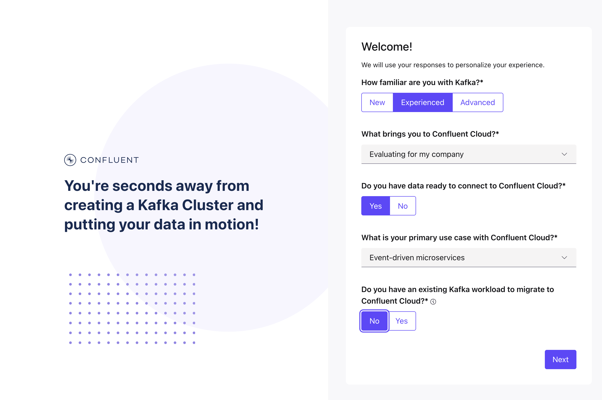
</div>

<div align="center" padding=25px>
    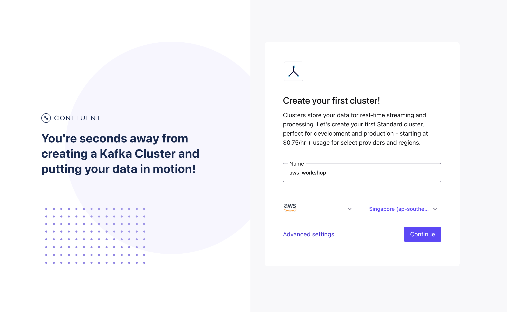
</div>

<div align="center" padding=25px>
    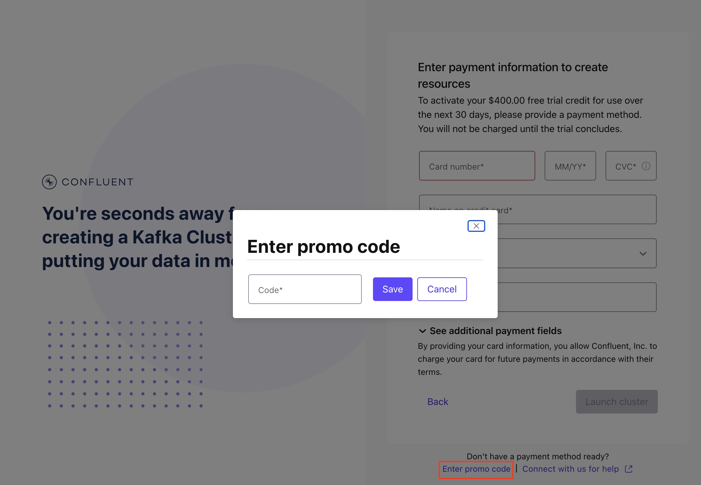
</div>

**PROMO CODE: https://docs.google.com/spreadsheets/d/1dFwSjHxI-wYHd675Pte_ugmDCqV9OEo3-K_RLPeP2f0/edit?usp=sharing**

2. Confluent Cloud cluster with Advanced Stream Governance package
3. For clients, it recommended to use latest version as Confluent Cloud always maintained the latest patch of Kafka version.

***

## **Objective**

<br>

Welcome to “Build Predictive Machine Learning Models Using Streaming Data Pipelines”! In this workshop, you will discover how to leverage the capabilities of Confluent Cloud to enable the development of predictive machine learning models using streaming data. We will focus on showcasing how Confluent Cloud, along with Apache Flink and Kafka, can facilitate the creation and deployment of effective data pipelines for real-time analytics.

By the end of this workshop, you'll have a clear understanding of how to utilize Confluent Cloud’s features to build a foundation for machine learning applications, empowering you to transform your streaming data into valuable predictions and insights.

<div align="center" padding=25px>
    
</div>

***


## <a name="step-1"></a>Log into Confluent Cloud

1. Log into [Confluent Cloud](https://confluent.cloud) and enter your email and password, If you don't have account you could sign up and use this promo code to access Confluent Cloud **POPTOUT0008UZQK**.

<div align="center" padding=25px>
    
</div>

2. If you are logging in for the first time, you will see a self-guided wizard that walks you through spinning up a cluster. Please minimize this as you will walk through those steps in this workshop. 

***

## <a name="step-2"></a>Create an Environment and Cluster

An environment contains clusters and its deployed components such as Apache Flink, Connectors, ksqlDB, and Schema Registry. You have the ability to create different environments based on your company's requirements. For example, you can use environments to separate Development/Testing, Pre-Production, and Production clusters. 

1. Click **+ Add cloud environment**. Specify an **Environment Name** and choose the **Essential Package** for stream governance, then Click **Create**. 

>Stream Governance have two option **Essential** and **Advanced**, which in Advanced it will give you more rich features over the governance such as Stream Lineage up to 7 days, Data Catalog, Business Metadata, and unlimited Schema to be registered on Confluent Cloud.

>_**Note:** There is a *default* environment ready in your account upon account creation. You can use this *default* environment for the purpose of this workshop if you do not wish to create an additional environment._

<div align="center" padding=25px>
    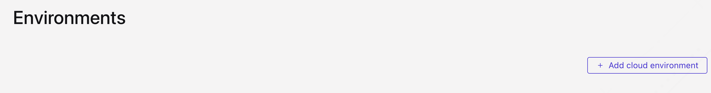
</div>

<div align="center" padding=25px>
    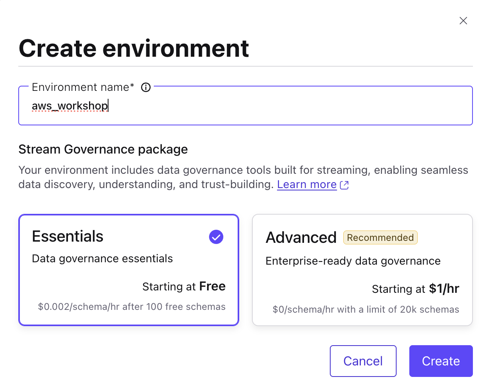
</div>

2. Now that you have an environment, click **Create Cluster**. 

> **Note:** Confluent Cloud clusters are available in 3 types: Basic, Standard, and Dedicated. Basic is intended for development use cases so you will use that for the workshop. Basic clusters only support single zone availability. Standard and Dedicated clusters are intended for production use and support Multi-zone deployments. If you are interested in learning more about the different types of clusters and their associated features and limits, refer to this [documentation](https://docs.confluent.io/current/cloud/clusters/cluster-types.html).

3. Chose the **Basic** cluster type. 

<div align="center" padding=25px>
    
</div>

4. Click **Begin Configuration**. 
5. Choose **GCP** as your preferred Cloud Provide on **asia-southeast2/ap-southeast-3 (Jakarta)** region, and **Single-AZ** availability zone. 
6. Specify a **Cluster Name**. For the purpose of this lab, any name will work here. 

<div align="center" padding=25px>
    
</div>

7. View the associated *Configuration & Cost*, *Usage Limits*, and *Uptime SLA* information before launching. 
8. Click **Launch Cluster**. 

***

## <a name="step-3"></a>Create an API Key

1. Click **API Keys** on the navigation menu. 
2. Click **Create Key** in order to create your first API Key. If you have an existing API Key select **+ Add Key** to create another API Key.

<div align="center" padding=25px>
    
</div>

3. Select **Global Access** and then click **Next**. 
4. Copy or save your API Key and Secret somewhere. You will need these later on in the lab, you will not be able to view the secret again once you close this dialogue. 
5. After creating and saving the API key, you will see this API key in the Confluent Cloud UI in the **API Keys** section. If you don’t see the API key populate right away, refresh the browser.
6. Go back to the environment page and select Schema Registry (SR) and copy the Schema Registry endpoint
<div align="center" padding=25px>
    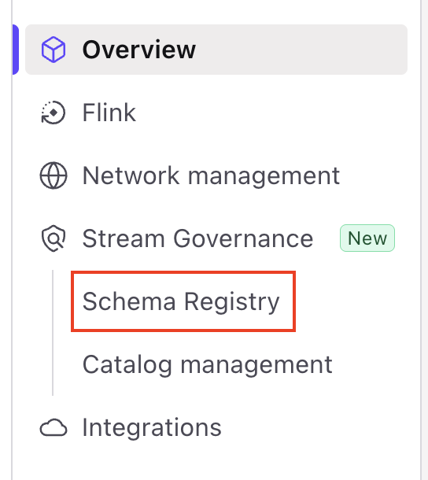
</div>
<div align="center" padding=25px>
    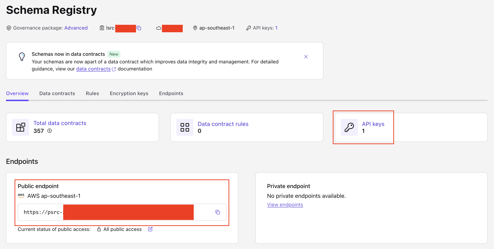
</div>

7. Click the API Key to **+Add API Key**
8. Then copy and save your **SR API Key** and **SR API Secret**.

***

## <a name="step-4"></a>Creates Topic and Walk Through Cloud Dashboard

1. On the navigation menu, you will see **Cluster Overview**. 
1. On the navigation menu, you will see **Cluster Overview**. 

> **Note:** This section shows Cluster Metrics, such as Throughput and Storage. This page also shows the number of Topics, Partitions, Connectors, and ksqlDB Applications.  Below is an example of the metrics dashboard once you have data flowing through Confluent Cloud.

2. Click on **Cluster Settings**. This is where you can find your *Cluster ID, Bootstrap Server, Cloud Details, Cluster Type,* and *Capacity Limits*.
3. On the same navigation menu, select **Topics** and click **Create Topic**. 
4. Enter **transactions** as the topic name, **1** as the number of partitions, and then click **Create with defaults**. Skip the data contracts as it will be created on the other step. 

<div align="center" padding=25px>
    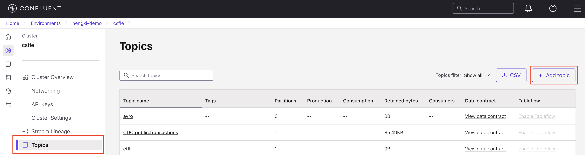
</div>

<div align="center" padding=25px>
    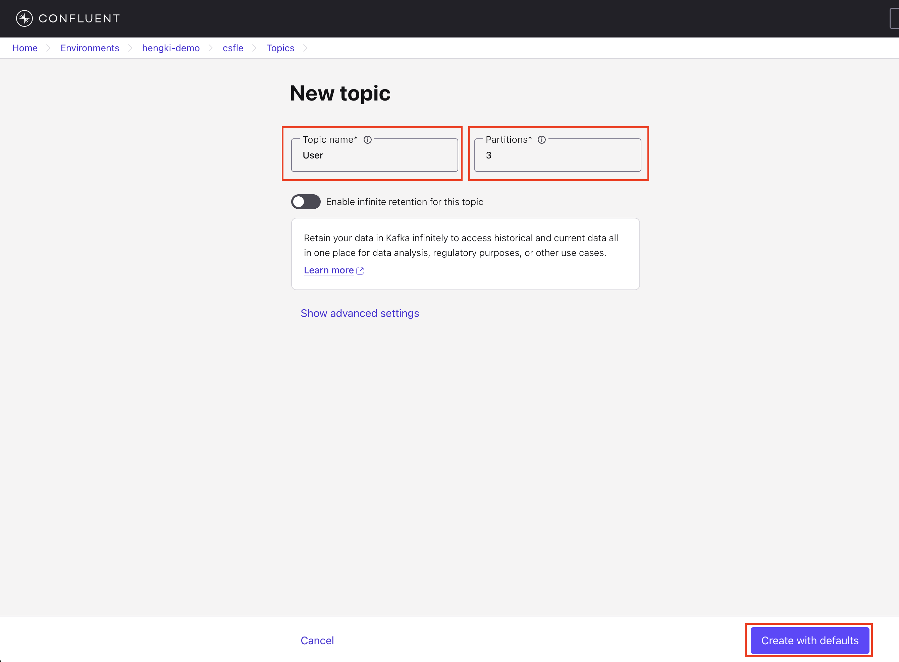
</div>

6. After topic creation, the **Topics UI** allows you to monitor production and consumption throughput metrics and the configuration parameters for your topics. When you begin sending messages to Confluent Cloud, you will be able to view those messages and message schemas.
   
***


## <a name="step-5"></a>Create CDC Connectors for Customers and Credit Cards
1. Let's create CDC PostgreSQL Source Connector on Confluent Cloud, go back to the Cluster page Overview and click **Connectors** on the left tab

2. Search and Click **Postgres CDC Source V2 (Debezium) connector**

3. Fill up the config by using the value on this table and click launch
<div align="center">

| section                            |setting                             | value                        |
|------------------------------------|------------------------------------|------------------------------|
| (1) Kafka credentials              | api key                            | [*from step 5* ](#step-5)    |
| (1) Kafka credentials              | api secret                         | [*from step 5* ](#step-5)    |
| (2) Authentication                 | database hostname                  | 34.101.213.158               |
| (2) Authentication                 | database port                      | 5432                         |
| (2) Authentication                 | database username                  | replica                      |
| (2) Authentication                 | database password                  | [will be distributed]        |
| (2) Authentication                 | database name                      | postgres                     |
| (2) Authentication                 | ssl mode                           | prefer                       |
| (3) Configuration                  | output record value                | AVRO                         |
| (3) Configuration                  | output record key                  | AVRO                         |
| (3) Configuration                  | topic prefix                       | CDC                          |
| (3) Configuration                  | slot name                          | [yourname]_debezium          |
| (3) Configuration                  | publication name                   | [yourname]_dbz_publication   |
| (3) Configuration                  | tables included                    | public.*                     |
| (3) Configuration                  | value converter decimal format     | NUMERIC                      |
| (3) Configuration                  | after-state only                   | true                         |
| (3) Configuration                  | decimal handling mode              | double                       |
| (3) Configuration                  | time precision mode                | connect                      |
| (3) Configuration                  | transform name                     | Topic_regexrouter            |
| (3) Configuration                  | transform type                     | TopicRegexRouter             |
| (3) Configuration                  | regex                              | ^[^.]+\.[^.]+\.(.*)$         |
| (3) Configuration                  | replacement                        | [yourname]_$1                |
| (4) Sizing                         | tasks                              | 1                            |
| (5) Review and Launch              | connector name                     | PostgreSQL_CDC_Source        |
</div>

<div align="center" padding=25px>
    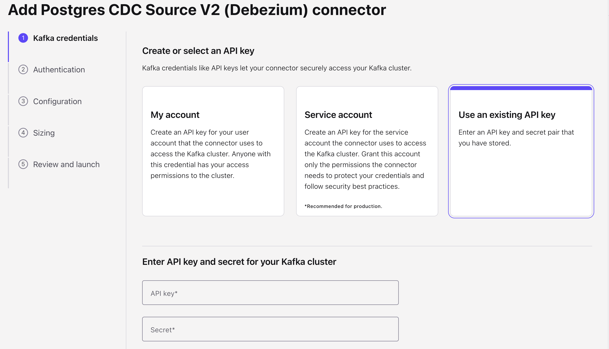
</div>

<div align="center" padding=25px>
    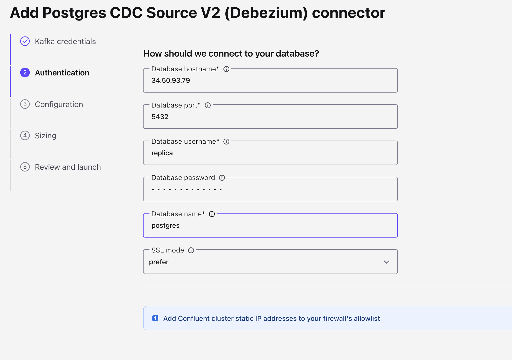
</div>

<div align="center" padding=25px>
    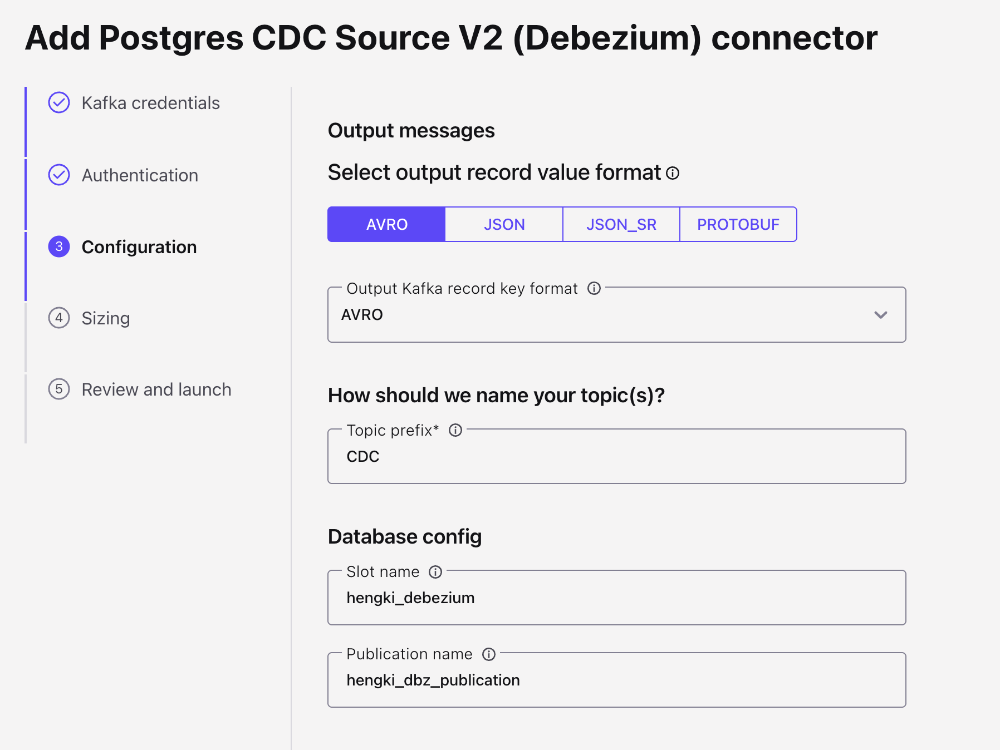
</div>

<div align="center" padding=25px>
    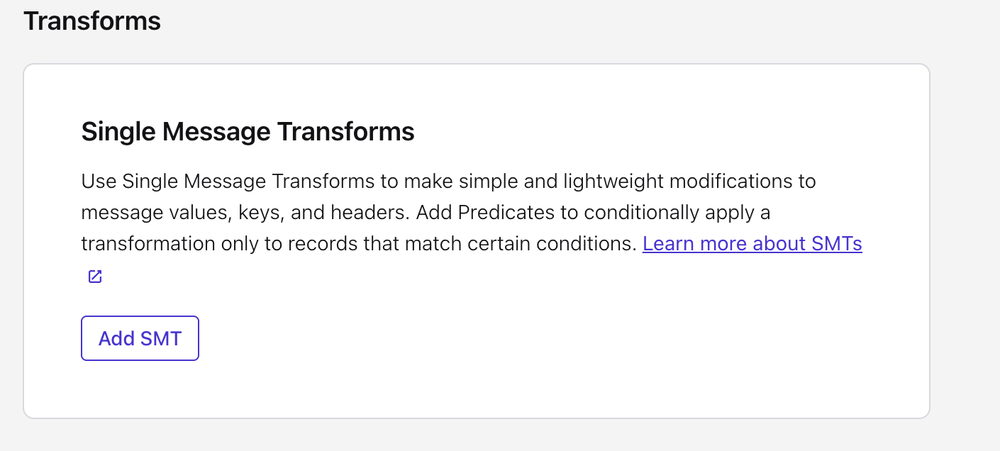
</div>

<div align="center" padding=25px>
    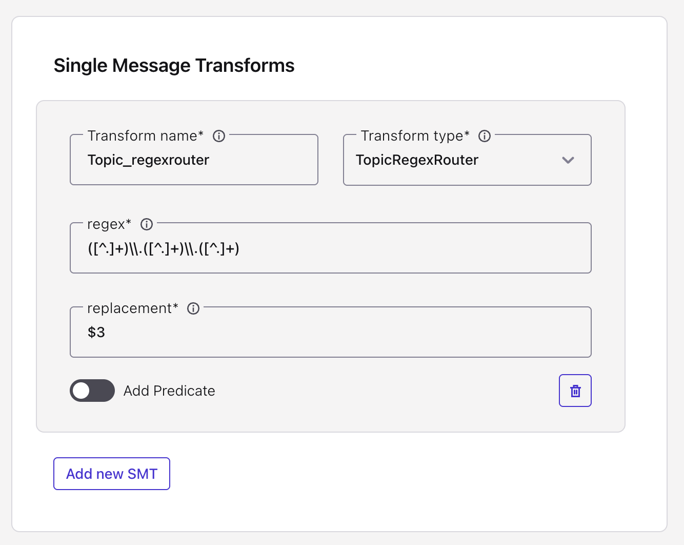
</div>

<div align="center" padding=25px>
    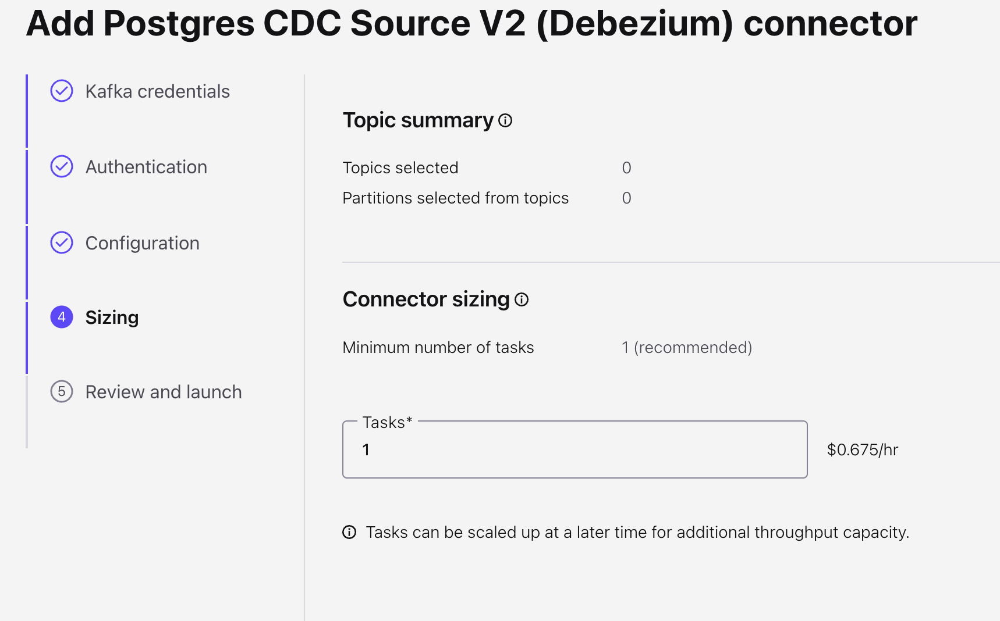
</div>

<div align="center" padding=25px>
    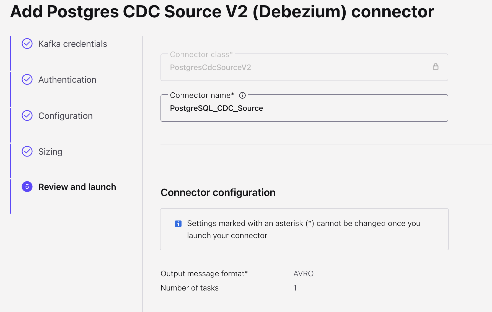
</div>

4. After launch the connector, you will see new topic created and you can see the transaction message that keep updating from the table
**Notes**: if you have DBeaver or any universal database manager, you could access the DB to read the value.

***

## <a name="step-6"></a>Configure the clients.
The next step is to run the producer to produce transaction records to the **transactions** topic.

1. Open VS Code or any editor of your choice and open the github repository folder, for example
```bash
cd workshop-fraud-detection-flink-gcp
```
3. Create a virtual environment for this project and activate it by running the following command
```bash
python3 -m venv _venv

Linux:
source _venv/bin/activate

or

Windows:
_venv\Scripts\activate
```
4. Install the dependencies by running the following commmand.
```bash
pip3 install -r requirement.txt
```
5. Create a ```client.properties``` and ```schema.properties``` files in the current folder. Let these be empty now we'll paste the configurations in the next step.

## <a name="step-7"></a>Create a Python Client for transactions topic
The next step is to produce sample data using a client. You will configure a python client for **transactions** topic.

1. From the Confluent Cloud UI, click on the **Clients** tab on the navigation menu. Click on the **Add new client** button on the top right.
<div align="center" padding=25px>
    
</div>

2. Choose **Python** in choose your language option.
<div align="center" padding=25px>
    
</div>

3. Click on  **Use existing API Key** in select an API key and fill out the downloaded API keys.
<div align="center" padding=25px>
    
</div>

4. Click on  **Use existing topic** in type **transactions**.
5. Copy the configuration snippet shown in the screen and paste in ```client.properties``` file.
```bash
# Required connection configs for Kafka producer, consumer, and admin
bootstrap.servers=pkc-p11xm.us-east-1.aws.confluent.cloud:9092
security.protocol=SASL_SSL
sasl.mechanisms=PLAIN
sasl.username=xxxxxxxxxxxx
sasl.password=xxxxxxxxxxxxxxxxxxxxxxxxxxxx

# Best practice for higher availability in librdkafka clients prior to 1.7
session.timeout.ms=45000

client.id=ccloud-python-client-3b98b537-adba-4c2d-b36f-79f964f031c0

```

6. Scroll down and click on **View Clients** button. However you can't see any clients yet as there are no applications currently talking to topics yet.
7. Click on **Environments** in the top left of the screen and choose your environment.
8. Scroll down at the right hand side of the screen, you'll see the stream governance details like below
<div align="center" padding=25px>
    
</div>

9. Copy the endpoint of Stream Governance API and create a new credentials to access this by clicking on **Add Key**.
10. Paste the endpoint and API Keys in ```schema.properties``` file like below:
```bash
schema.registry.url=https://psrc-em25q.us-east-2.aws.confluent.cloud
schema.registry.username=xxxxxxxxxx
schema.registry.password=xxxxxxxxxxxxxxxxxxxxxxxxxxxxxxx
```

10. Run the ```producer.py``` file by running the following command.
```bash
python3 producer.py
```
You can see records being published to transactions topic.
> **Note:** If the producer fails, there are a few different ways to troubleshoot the error:
> * Click on the *Cluster Overiview*, go to *Cluster Settings*,. Double check there are no extra spaces at the beginning or end of the key and secret that you may have accidentally copied and pasted in ```client.properties``` file also verify the ```bootstrap.servers``` value by comparing it with the *Bootstrap Server* value in the Endpoints section in UI. Also verify the ```schema.properties```


## <a name="step-8"></a>Perform complex joins using Flink to combine the records into one topic
Kafka topics and schemas are always in sync with our Flink cluster. Any topic created in Kafka is visible directly as a table in Flink, and any table created in Flink is visible as a topic in Kafka. Effectively, Flink provides a SQL interface on top of Confluent Cloud.

1. From the Confluent Cloud UI, click on the **Environments** tab on the navigation menu. Choose your environment.
2. Click on *Flink* from the menu pane
3. Choose the compute pool created in the previous steps.
4. Click on **Open SQL workspace** button on the top right.
5. Create an **aggregated_transactions** table by running the following SQL query.
```sql
CREATE TABLE aggregated_transactions (
    transaction_id INT NOT NULL PRIMARY KEY NOT ENFORCED,
    credit_card_number BIGINT,
    customer_email STRING,
    total_amount INT,
    average_spending_amount INT,
    transaction_timestamp TIMESTAMP(3),
    WATERMARK FOR transaction_timestamp AS transaction_timestamp - INTERVAL '1' SECOND
) WITH (
    'changelog.mode' = 'upsert'
);
```

6. Add a new query by clicking on + icon in the left of previous query to Insert records to the above table by running the following query.
```sql
INSERT INTO aggregated_transactions
SELECT 
    t.transaction_id,
    t.credit_card_number,
    cust.customer_email,
    t.amount,
    cust.average_spending_amount,
    TO_TIMESTAMP(t.transaction_timestamp) AS transaction_timestamp
FROM transactions t
INNER JOIN <yourname>_credit_cards cc ON t.credit_card_number = cc.credit_card_number
INNER JOIN <yourname>_customers cust ON cc.customer_id = cust.customer_id
```
7. Now we will create a ```feature_set``` topic to put all the transactions in specific windows. To perform the same run the following query.
```sql
CREATE TABLE feature_set (
    credit_card_number BIGINT PRIMARY KEY NOT ENFORCED,
    customer_email STRING,
    total_amount INT,
    transaction_count BIGINT,
    average_spending_amount INT,
    window_start TIMESTAMP(3),
    window_end TIMESTAMP(3)
) WITH (
  'changelog.mode' = 'upsert',
  'value.format' = 'json-registry',
  'key.format' = 'json-registry'
)
```
```sql
INSERT INTO feature_set
  WITH windowed_transactions AS (
SELECT 
    credit_card_number,
    SUM(total_amount) AS total_amount,
    COUNT(transaction_id) AS transaction_count,
    window_start,
    window_end
FROM 
  TABLE(
    TUMBLE(TABLE aggregated_transactions, DESCRIPTOR(transaction_timestamp),INTERVAL '10' MINUTES)
  )
GROUP BY credit_card_number, window_start,window_end
)
SELECT DISTINCT
  t.credit_card_number,
  t.customer_email,
  wt.total_amount,
  wt.transaction_count,
  t.average_spending_amount,
  wt.window_start,
  wt.window_end
 FROM 
  aggregated_transactions t
 JOIN
   windowed_transactions wt
 ON
  wt.credit_card_number = t.credit_card_number
 AND
  t.transaction_timestamp BETWEEN wt.window_start AND wt.window_end
```

Windows are central to processing infinite streams. Windows split the stream into “buckets” of finite size, over which you can apply computations. This document focuses on how windowing is performed in Confluent Cloud for Apache Flink and how you can benefit from windowed functions.

Flink provides several window table-valued functions (TVF) to divide the elements of your table into windows, including:

a. [Tumble Windows](https://docs.confluent.io/cloud/current/flink/reference/queries/window-tvf.html#flink-sql-window-tvfs-tumble)
<br> 
b. [Hop Windows](https://docs.confluent.io/cloud/current/flink/reference/queries/window-tvf.html#flink-sql-window-tvfs-hop)
<br> 
c. [Cumulate Windows](https://docs.confluent.io/cloud/current/flink/reference/queries/window-tvf.html#flink-sql-window-tvfs-cumulate)
<br> 

## <a name="step-9"></a>Consume feature set topic and predict fraud transactions

### 9.1 Prepare Fraudulent transactions by rules

```sql
CREATE TABLE `<yourname>_fraudulent_transactions` (
    credit_card_number BIGINT PRIMARY KEY NOT ENFORCED,
    customer_email STRING,
    total_amount INT,
    transaction_count BIGINT,
    average_spending_amount INT,
    window_start TIMESTAMP(3),
    window_end TIMESTAMP(3)
) WITH (
  'changelog.mode' = 'upsert',
  'value.format' = 'json-registry',
  'key.format' = 'json-registry'
)
AS
SELECT
  credit_card_number,
  customer_email,
  total_amount,
  transaction_count,
  average_spending_amount,
  window_start,
  window_end
 FROM 
  <yourname>_feature_set
 WHERE `transaction_count`>=2 AND `total_amount`>`average_spending_amount`;
```

### 9.2 Prepare LLM Access (Bedrock Model)
You have two options:

- **Option A (Lab sample):**
  - **API Key:** **`ask to your instructors`**
  - **Gemini Endpoint:** `https://generativelanguage.googleapis.com/v1beta/models/gemini-2.0-flash:generateContent`

- **Option B (Use your own):**
  1. Go to https://aistudio.google.com → **Get API Key** → create or copy your key.
  2. Note the **API Endpoint** (the URL before `?key=GEMINI_API_KEY`), e.g.  
     `https://generativelanguage.googleapis.com/v1beta/models/gemini-2.0-flash:generateContent`

> **Security Tip:** Treat API keys as secrets. Prefer environment variables or secret managers in real projects.

### 9.3 Create Model Connection via Confluent UI
1. Go back to the environment page and click the **Integration** tab on the left side and click **+ Add Connection**
    <div align="center" padding=25px>
        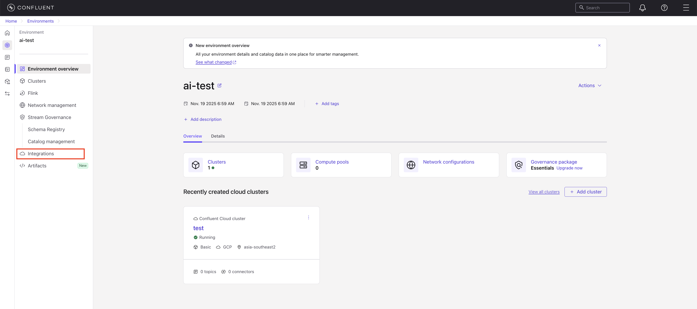
    </div>
    
    <div align="center" padding=25px>
        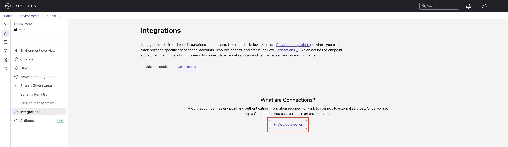
    </div>
    
2. Choose your LLM connection for your project
   <div align="center" padding=25px>
        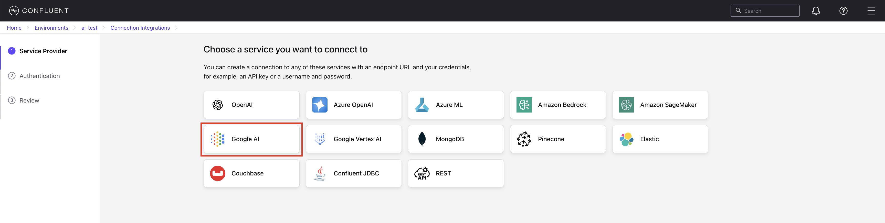
    </div>
    
3. Define your connection by set the ai endpoint, key and secret 
   <div align="center" padding=25px>
        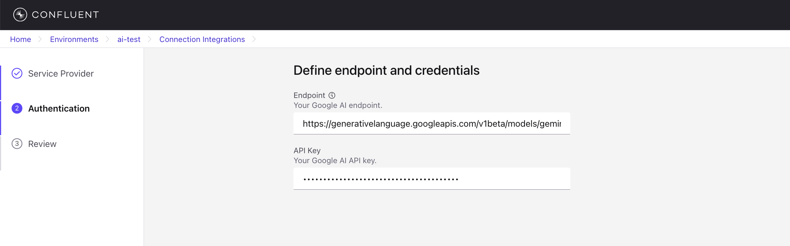
    </div>

4. On the last page change the connection name and set the cloud provider that your cluster belongs to, including the region
    <div align="center" padding=25px>
            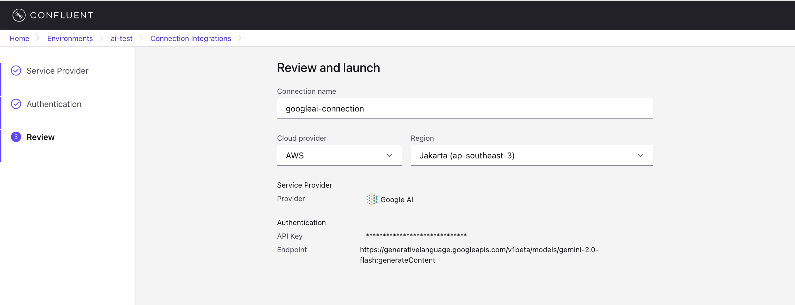
    </div>

### 9.4 Create AI Model in Flink SQL
Create a model with inputs/outputs and a system prompt describing the decision logic.

```sql
CREATE MODEL fraud_notification
INPUT(message STRING)
OUTPUT(notif STRING)
COMMENT 'Analyze and determine suspicious transaction'
WITH (
'provider' = 'bedrock',
'task' = 'text_generation',
'bedrock.connection'='bedrock-claude-connection',
'bedrock.PARAMS.max_tokens' = '2000',
'bedrock.system_prompt' = 'You’re a fraud analyst on bank syariah with that will check suspicious transaction, you need to analyst and give a proper reasoning why it is being set as fraudulent transactions and create a body message notification to the customers, create the message in proper language as formal notification but not reduce the urgency to act based on what you have analyst on the information that you get.'
);
```

### 9.5 Invoke the Model
Invoke the model against the joined feed and return the decision + reasoning.

```sql
ALTER TABLE `<yourname>_fraudulent_transactions` SET ('changelog.mode' = 'append');
```

```sql
SELECT f.`credit_card_number`, f.customer_email, notif
FROM <yourname>_fraudulent_transactions f,
LATERAL TABLE(ML_PREDICT('fraud_notification', CONCAT(
  'You will analyze the input and check the suspicious transactions.\n\n',
      'Instructions:\n',
      '- Give the best reasoning based on your input and analysis',
      'Input Data:\n',
  'Credit card number: ', CAST(f.credit_card_number AS STRING), '\n',
  'Customer email: ', f.customer_email, '\n',
  'Total amount: ', CAST(f.total_amount AS STRING), '\n',
  'Transaction count: ', CAST(f.transaction_count AS STRING), '\n',
  'Average spending amount: ', CAST(f.average_spending_amount AS STRING), '\n',
      'Expected Output – Notification message',
      'Notification: \n\n<Body of Notification message>'
)));
```

## <a name="step-10"></a>Flink Monitoring
1. Status of all the Flink Jobs is available under **Flink Statements** Tab.
   
<div align="center">
    
</div>

2. Utilization information.
<div align="center">
    
</div>

<br> 


***

## <a name="step-11"></a>Clean Up Resources

Deleting the resources you created during this workshop will prevent you from incurring additional charges. 

1. The first item to delete is the Apache Flink Compute Pool. Select the **Delete** button under **Actions** and enter the **Application Name** to confirm the deletion. 
<div align="center">
    
</div>

2. Next, delete the Datagen Source connectors for **credit_cards_connector**, **customers_connector**. Navigate to the **Connectors** tab and select each connector. In the settings tab, you will see a **trash** icon on the bottom of the page. Click the icon and enter the **Connector Name**.
<div align="center">
    
</div>

3. Next, under **Cluster Settings**, select the **Delete Cluster** button at the bottom. Enter the **Cluster Name** and select **Confirm**. 
<div align="center">
    
</div>

4. Finally, to remove all resource pertaining to this workshop, delete the environment **workshop**.
<div align="center">
    
</div>
*** 

## <a name="step-12"></a>Confluent Resources and Further Testing

Here are some links to check out if you are interested in further testing:
- [Confluent Cloud Documentation](https://docs.confluent.io/cloud/current/overview.html)
- [Apache Flink 101](https://developer.confluent.io/courses/apache-flink/intro/)
- [Stream Processing with Confluent Cloud for Apache Flink](https://docs.confluent.io/cloud/current/flink/index.html)
- [Flink SQL Reference](https://docs.confluent.io/cloud/current/flink/reference/overview.html)
- [Flink SQL Functions](https://docs.confluent.io/cloud/current/flink/reference/functions/overview.html)

***
